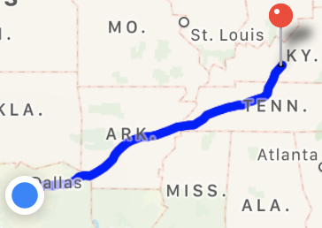

# Parkacation

Is an application that allows users to plan a vacation around *National Parks* and *Historical Monuments* in the United States.  It is an application where users learn about history that surrounds the National Park or Historical Monument.

## Features

- Find all National Parks and Historical Monuments by State
- Save Park or Monument to favorites
- Get turn by turn driving directions
- Link to National Park Service where detail information is provided on Alerts, Hours etc.
- Facebook Login or Register with Email/Password

### API

- Firebase: Used to manage authetication,and authorization for application
- Firebase Storage: Holds Images of States
- National Park Service (NPS): An Api service that is regular updated with National Parks and Historical information.  The NPS You'll find photos and essential information about NPS sites including visitor centers, campgrounds, events, news, alerts, and more, as well as detailed articles about NPS natural and cultural features and important people and places.

### Login / Registration

A user presented with a simple and easy registion process.  After the user logs into the applicaiton a unique key is saved to User Defaults. If the User Exits the application and returns the application provides the user with auto login process and go directly to the Packacation Home Page.

## Parkacation Home Page
 
The home page is presented in a Tab format where three option are presented to the user.

- Park Collection - presents a state flag for each state  
- List View - presents the user with flags as a list
- Favorites - list of favorite parks

### Park Collection / List View
National Park and Monument -  When a user clicks on a state flag, they are taken directly to that state where Pins are displayed on a map showing National Parks and Historical data.

If a user taps on a pin, the accessory provides a link for that specific park or monument. The links takes the users to the National Park Services

### Route / Turn By Turn Directions
- When a user click on a row selection of a National Park or Monument. The fastest route from current position to National Park or Monument is calculated and displayed on a map. A route drawn on the on a map with the user location show as flashing blue circle,

| Tables        |                                                                |
| ------------- |:--------------------------------------------------------------:|
| Fastes Route  |    |

### Favorites

On favorites screen a map view with *Markers*  are show and a table listing is provided of favorite park or monument. 

### Pods

How to build application requires the following pods.  Open up a terminal window and go to the your project directory and  perform the following steps to Create a Podfile and build the application.

Create Podfile: pod init

Open Podfile:  open -a Xcode Podfile

Add pods:

 - pod 'Firebase/Storage'
 - pod 'Firebase/Database'
 - pod 'Firebase/Core'
 - pod 'Firebase/RemoteConfig'
 - pod 'FirebaseUI'
 - pod 'Firebase/Auth'
 - pod 'FBSDKCoreKit'
 - pod 'FBSDKShareKit'
 - pod 'FBSDKLoginKit'
  
Close pod

Excute Command: pod install

## Author

***Darin Williams** - *Initial work* -(https://github.com/darinjswilliams/ParkacationFinal)
